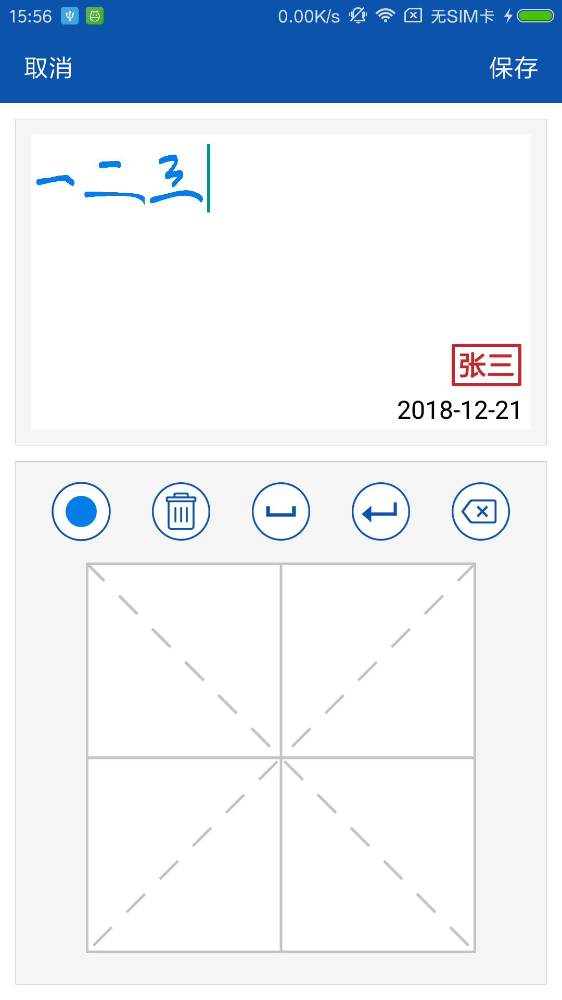

# 带笔锋效果的手写签字控件

Android平台原生手写签字控件，功能强大的开源项目。

## 预览

  

## 功能

- 空白画板手写，田字格逐字手写
- 实现笔锋效果
- 支持橡皮擦，撤回/恢复，清空画布功能
- 画笔颜色大小设置
- 支持传入初始图片 
- 画布大小设置，文字区域裁剪
- 主题颜色设置
- 支持传入初始显示图片
- 适配手机横竖屏布局

## 用法

本项目暂未上传至gradle库，请下载源码参考示例工程，方便定制化自己的需求。

## 后记

本项目参考了这位大神的[安卓画笔笔锋的实现探索](https://www.jianshu.com/p/6746d68ef2c3)中对于笔锋算法的实现。
项目仅供交流学习使用，目前市面上大部分手写签字功能是不开放的或者需要收费的，其他开源的应该功能没我这个丰富，开发不易，如果觉得本项目对您有帮助，请给个star，谢谢！

> 如果你在使用过程发现Bug，欢迎在issue中向我提出

开发不易，如果觉得对您有帮助，可以赏个小红包，一分两分也是爱，谢谢！

